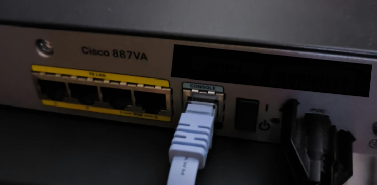
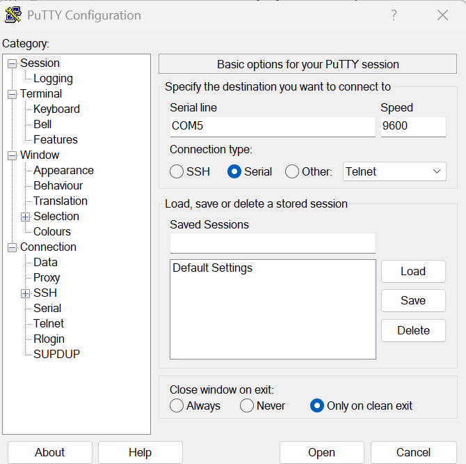

# Cisco-IOS-Access-Recovery_Reset
## **Lab01:** Recuperación de Acceso IOS en Router Cisco /  -Restablecimiento a configuracion de fabrica (Factory Reset)

##  Objetivo 1: Reestablecer la configuracion del router a fabrica usando Cisco IOS
  
1. Conectamos un cable de consola al puerto usb de nuestra portatil o PC y el otro extremo al puerto CONSOLE del router.
2. Ejecutamos un programa de terminal como PuTTy y colocamos las siguientes opciones:
   Connection Type: Serial
   Speed: 9600
   Serial Line: Abrimos dispositivos de windows y revisamos que puerto COM se ha asignado y se coloca por ejemplo "COM5"
   Si es Linux por ejemplo: /dev/ttyUSB0
3. Le damos a Open en el PuTTy
4. Encendemos el Router

   

